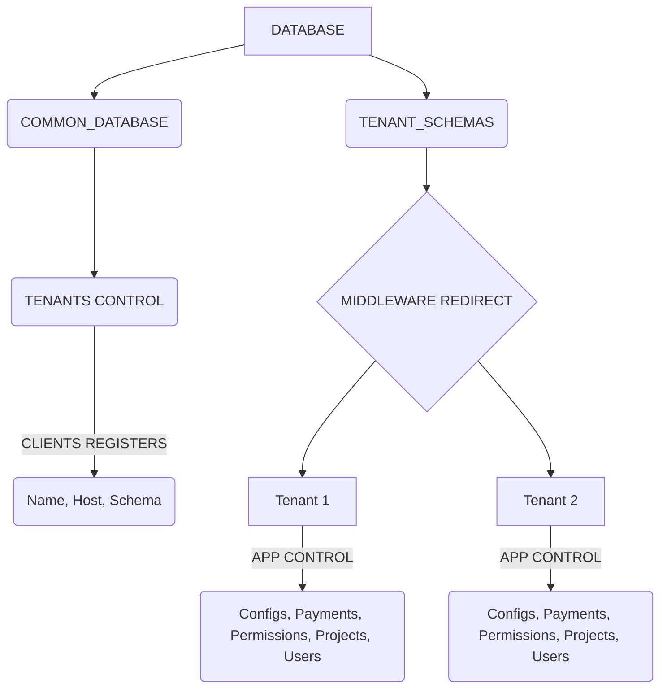

---
hide:
  - toc
---

# **Models e Migrações**

### Para tudo funcionar bem, por aqui temos uma restrição baseada no Host, que define para onde vai cada coisa, sendo assim, precisamos entender um pouco melhor como tudo está organizado, e como adicionar um novo cliente.

### **O nosso diagrama de dados se comporta da seguinte maneira:**

## A criação de novos hosts devem passar pelas seguintes etapas
1. Criação de um novo **Schema** dentro do banco de dados
2. Registro do **Schema** dentro de **Tenants Control**, adicionando ao cliente um Nome e um Host
3. Migração do novo Tenant para criação das tabelas e definição dos valores padrão

Quer criar um novo cliente? [Clique Aqui](./new_host/first_step.md) para ver os passos.